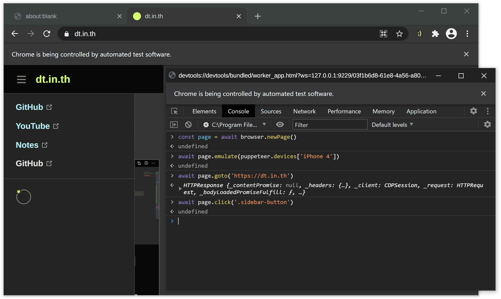

# Tester’s friend

A tool for **semi-automated testing.** Use cases:

- For when you want to do **exploratory testing** but doing everything manually is too tedious.
- For when you want to do **replicate a bug** repeatedly but don’t want to do it all manually.
- When you don’t have the resource to set up a full test automation system but would still benefit from little automation here and there. At least less efficient stuff can be done more efficiently.

This tool:

- Opens up **Chromium** (Google Chrome) with a JavaScript console to let you use JavaScript to automate it.
- Everytime you run you get a **blank profile**. This makes for a more reproducable tests.
- Based on **Puppeteer** so you can reuse the knowledge to write fully-automated tests with Puppeteer.
- TODO

## Usage

This tool is in development... You have to run from source.

1. Make sure you have Node.js 18+ and pnpm installed.
2. Clone the repository.
3. `pnpm install`
4. `node dev`
